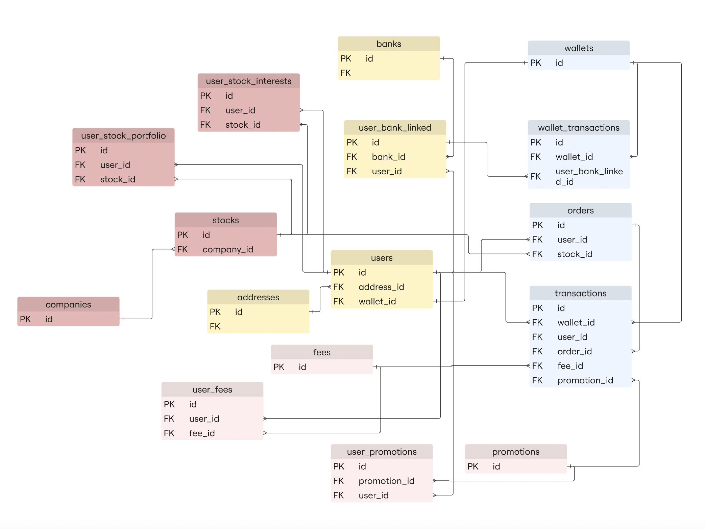

# ERD DESIGN FOR TRADING APP

> Status: **draft** — this is a draft ERD for the simulated trading app's database
> (`simulated_app`). The schema currently implemented in
> [`generate_script.sql`](generate_script.sql) only has the `test.users` table (with `address`
> stuffed into a JSONB column) — everything below is the *target* this design is working toward,
> not what's actually running in Postgres yet.

## 1. Purpose

This DB simulates the backend data of a stock trading app, used as the source for the
CDC → Landing → Bronze/Silver/Gold pipeline described in the [root README](../README.md). The
ERD is aimed at two goals:

1. **Realistic enough** to model the core workflows of a real trading app: customer identity
   (KYC), linked bank accounts, wallet funding (deposit/withdraw), buy/sell orders, and applying
   fees and promotions.
2. **Simple enough** to generate seed data and capture CDC changes easily — each table is an
   independent unit of change, instead of cramming all state into one giant `users` table.

## 2. Design Diagram



## 3. Table Groups (by diagram color)

The diagram color-codes tables into 4 business subdomains — reading it by color is easier than
looking at each table in isolation:

| Color group | Tables | Role |
|---|---|---|
| 🟤 Maroon — **Stocks & interest** | `companies`, `stocks`, `user_stock_portfolio`, `user_stock_interests` | Catalog of companies/tickers, and the user ↔ stock relationship (currently held / currently watched) |
| 🟡 Yellow — **Identity & bank linking** | `users`, `addresses`, `banks`, `user_bank_linked` | User profiles and the bank accounts they've linked for funding |
| 🔵 Blue-gray — **Wallet & trading** | `wallets`, `wallet_transactions`, `orders`, `transactions` | Wallet balances, money movement in/out of the wallet, and orders with their execution results |
| 🌸 Pink — **Fees & promotions** | `fees`, `user_fees`, `promotions`, `user_promotions` | Shared fee/promotion catalogs, and how they're applied to specific users/transactions |

## 4. What This Design Is For

The ERD isn't just a set of normalized tables — each part maps to a concrete capability the
trading app needs:

- **Record every customer transaction, end to end.** `wallet_transactions` captures money moving
  between a linked bank account and the wallet (deposits/withdrawals); `transactions` captures
  the result of a buy/sell trade. Both point back to `wallet_id` (and `transactions` also to
  `user_id`), so the full financial history of a customer — where their money came from and
  where it went — can be reconstructed from these two tables alone.
- **Track exactly what stock each customer owns, at any point in time.** `user_stock_portfolio`
  is the single source of truth for holdings (quantity per stock per user), updated whenever a
  `transactions` row is created from a filled order. This is what powers "my portfolio" screens
  and holding-value calculations.
- **Manage stock/company reference data in one place.** `companies` and `stocks` are the master
  catalog of what can be traded. `orders`, `user_stock_portfolio`, and `user_stock_interests` all
  point to `stocks.id`, so a ticker's info (or a company's) is maintained once and reused
  everywhere instead of being copied into every user-facing table.
- **Know who the customer is and how they can fund their account.** `users`/`addresses` hold the
  identity/KYC profile; `user_bank_linked` records which external bank accounts a customer has
  authorized to move money in and out of their wallet — a prerequisite for any deposit/withdraw
  flow.
- **Separate a customer's intent from what actually happened.** `orders` records what a customer
  *wants* to do (buy/sell a stock); `transactions` records what actually got executed. This lets
  the app track an order's lifecycle (pending/filled/cancelled) independently from settlement,
  and answer "why didn't my order go through" without touching money-movement data.
- **Apply and later audit fees/promotions per customer and per transaction.** `fees`/`promotions`
  are shared catalogs (e.g. "0.15% trading fee", "September cashback promo"); `user_fees`/
  `user_promotions` personalize them per customer (e.g. a VIP tier gets a lower fee, a specific
  user was granted a promo). `transactions.fee_id`/`promotion_id` then freezes exactly which fee
  and promo applied to *that* trade — so finance can reconcile revenue and promo cost
  historically even after the catalog changes later.
- **Distinguish "watching" from "owning" a stock**, so a watchlist feature (`user_stock_interests`)
  can be built and analyzed (e.g. for recommendations) without ever affecting portfolio or balance
  data in `user_stock_portfolio`.

## 5. Core Business Flows

### 5.1. User onboarding

```
addresses (new) ──┐
                   ├──> users (address_id, wallet_id)
wallets   (new) ───┘
```

A user signs up → an `addresses` row and a `wallets` row are created → a `users` row is created
pointing to both. Since it's a 1-to-1 relationship, each user has exactly one address and one
wallet of their own (not shared).

### 5.2. Bank linking & funding

```
users ──> user_bank_linked <── banks
                │
                ▼
        wallet_transactions ──> wallets (credit/debit balance)
```

1. A user links a `bank` → a `user_bank_linked` row is created (user_id + bank_id).
2. Depositing/withdrawing money → a `wallet_transactions` row is created, pointing to `wallet_id`
   (the affected wallet) and `user_bank_linked_id` (which linked bank account was used).

### 5.3. Watching & holding stocks

```
companies ──> stocks ──┬──> user_stock_interests  (watchlist)
                        └──> user_stock_portfolio   (currently held)
```

A `company` can have multiple `stocks` (multiple listed tickers). A user can watch
(`interests`) a stock before actually buying it; `portfolio` is only updated once a matching
`transactions` row exists from a filled order.

### 5.4. Placing an order → execution → updating wallet & portfolio

```
users ──> orders (user_id, stock_id)
             │
             ▼
        transactions (wallet_id, user_id, order_id, fee_id, promotion_id)
             │
             ├──> wallets            (debit/credit at execution price)
             └──> user_stock_portfolio (update quantity held)
```

1. A user places a buy/sell order on a stock → an `orders` row is created.
2. The order fills → a `transactions` row is created, recording exactly which `fee_id`/
   `promotion_id` applied at execution time (not re-looked-up from `user_fees`/`user_promotions`
   later — avoiding drift if the fee/promo catalog changes afterward).
3. Once `transactions` is settled → `wallets` balance and `user_stock_portfolio` holdings are
   updated.

### 5.5. Applying fees & promotions

```
fees ──> user_fees (assigned per user) ─┐
                                         ├──> transactions.fee_id / promotion_id
promotions ──> user_promotions ─────────┘
```

`fees`/`promotions` are shared catalogs; `user_fees`/`user_promotions` allow personalization
(e.g. a VIP user gets a lower fee, a specific user was granted a promo); the value actually
applied to a given transaction is "locked in" on `transactions`.

## 6. Table Details

### Stocks & interest group

| Table | Columns | Key | References | Notes |
|---|---|---|---|---|
| `companies` | `id` | PK | | Listed company |
| `stocks` | `id`, `company_id` | PK, FK | `companies.id` | 1 company → N stocks |
| `user_stock_portfolio` | `id`, `user_id`, `stock_id` | PK, FK, FK | `users.id`, `stocks.id` | Stock **currently held** |
| `user_stock_interests` | `id`, `user_id`, `stock_id` | PK, FK, FK | `users.id`, `stocks.id` | Watchlist |

### Identity & banking group

| Table | Columns | Key | References | Notes |
|---|---|---|---|---|
| `users` | `id`, `address_id`, `wallet_id` | PK, FK, FK | `addresses.id`, `wallets.id` | User profile; see the KYC/tier fields already in [`generate_script.sql`](generate_script.sql) |
| `addresses` | `id`, `FK` (unnamed) | PK, FK | *undetermined* | See section 7 — TODO |
| `banks` | `id`, `FK` (unnamed) | PK, FK | *undetermined* | Bank catalog; see section 7 — TODO |
| `user_bank_linked` | `id`, `bank_id`, `user_id` | PK, FK, FK | `banks.id`, `users.id` | N–N junction table, a user can link multiple banks |

### Wallet & trading group

| Table | Columns | Key | References | Notes |
|---|---|---|---|---|
| `wallets` | `id` | PK | | 1-to-1 with `users` |
| `wallet_transactions` | `id`, `wallet_id`, `user_bank_linked_id` | PK, FK, FK | `wallets.id`, `user_bank_linked.id` | Deposits/withdrawals via a linked bank |
| `orders` | `id`, `user_id`, `stock_id` | PK, FK, FK | `users.id`, `stocks.id` | Order intent |
| `transactions` | `id`, `wallet_id`, `user_id`, `order_id`, `fee_id`, `promotion_id` | PK, FK×5 | `wallets.id`, `users.id`, `orders.id`, `fees.id`, `promotions.id` | Execution result; `user_id` duplicates info already reachable via `wallet_id`→`users` (intentional denormalization for query convenience — see section 7) |

### Fees & promotions group

| Table | Columns | Key | References | Notes |
|---|---|---|---|---|
| `fees` | `id` | PK | | Fee catalog |
| `user_fees` | `id`, `user_id`, `fee_id` | PK, FK, FK | `users.id`, `fees.id` | Fee assigned per user (e.g. by tier) |
| `promotions` | `id` | PK | | Promotion catalog |
| `user_promotions` | `id`, `promotion_id`, `user_id` | PK, FK, FK | `promotions.id`, `users.id` | Promotion granted to a user |

## 7. Open Questions / TODO

Written down explicitly to avoid mis-implementing when this moves from draft to real schema:

1. **`banks.FK` and `addresses.FK` have no column name** in the diagram — unclear what they
   point to. A reasonable guess: `banks` might need an `address_id` (branch/HQ address) pointing
   to `addresses.id`; `addresses` might self-reference (`parent_address_id`) for a
   province → ward hierarchy instead of the current JSONB blob. Needs to be settled before
   writing DDL.
2. **`orders` has no business columns yet** (side buy/sell, quantity, price, status, timestamps)
   — the diagram currently only has keys. Same goes for `fees`, `promotions`, `banks`,
   `companies`, which currently only have `id`.
3. **`transactions` has both `wallet_id` and `user_id`**, even though `wallet_id` → `wallets` →
   `users` already implies `user_id`. This is intentional denormalization for query convenience,
   but needs a constraint (trigger or app-level check) to guarantee `user_id` always matches the
   owner of `wallet_id`, to avoid data drift.
4. **Is `orders` → `transactions` 1-to-1 or 1-to-N?** If partial fills are supported later, one
   `order` could produce multiple `transactions` rows — better to decide this now than migrate
   later.
5. **Missing a transaction-direction column** on `wallet_transactions` (deposit vs. withdraw) and
   `transactions` (buy vs. sell) — currently only inferable from the FKs, which isn't enough to
   distinguish the actual business event.
6. **Coverage gap vs. the schema already running**: today's `test.users` (in
   `generate_script.sql`) doesn't yet have FK-style `wallet_id`/`address_id` columns — realizing
   this ERD requires a migration plan to move the JSONB `address` column into a proper normalized
   `addresses` table, and to add `wallet_id`.
